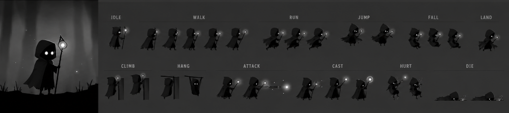

# NEMO – The Last Drop

> *A cinematic 2.5D puzzle-adventure about shadows, memories, and finding the light within.*



## 🎮 Play

Open `index.html` in a modern web browser, or visit the [live demo on GitHub Pages](#).

**Controls:**
| Action | Key |
|--------|-----|
| Move | WASD / Arrow Keys |
| Jump | Space |
| Run | Shift |
| Interact | E |
| Lantern | F |
| Dash | Q |
| Pause | Escape |
| Memories | Tab / M |

## 📖 Story

Nemo is a lonely teenager who wakes up in **The Hollow** — a mysterious shadow realm created from his own memories, regrets, and desire to disappear. Each area represents one of his emotions: Despair Forest, Forgotten Village, Echo Cave, Drowned Marsh, Tower of Regret, and Final Memory.

The journey is not about survival. It's about discovering whether life is worth continuing.

## 🌊 Features

- **6 Chapters** with unique environments, puzzles, and enemies
- **Thirst Survival System** — find water to survive; low thirst causes hallucinations
- **5 Monster Types** — each with unique AI and behaviors
- **Environmental Puzzles** — shadow manipulation, light beams, water flow, sound, physics
- **Procedural Audio** — piano soundtrack and ambient sounds generated in real-time
- **Dynamic Lighting** — lantern with volumetric shadows and darkness
- **Atmospheric Effects** — volumetric fog, rain, wind, particles, screen effects
- **3 Endings** based on collectibles found and player choices
- **30 Memory Fragments** to discover
- **Save/Load** via localStorage

## 🛠️ Tech

Built with vanilla HTML5 Canvas + JavaScript — no dependencies, no build step.

- 4-layer canvas rendering (background → game → lighting → UI)
- WebGL-fallback post-processing (vignette, bloom, film grain)
- Web Audio API procedural music and SFX
- Fixed-timestep game loop at 60fps

## 📁 Project Structure

```
nemo-game/
├── index.html          # Entry point
├── style.css           # Styles
├── assets/sprites/     # Sprite sheet
└── src/
    ├── main.js         # Bootstrap
    ├── engine/         # Core: Game, Renderer, Camera, Physics, Input
    ├── entities/       # Player, Monsters, Collectibles
    ├── systems/        # Thirst, Lighting, Particles, Fog, Weather, Audio, PostFX
    ├── ui/             # HUD, Dialogue, Menus, Transitions
    ├── levels/         # LevelManager, Parallax, LevelGenerator
    └── data/           # Config, Sprites, Story, Levels
```

## ⚠️ Content Notice

This game explores themes of loneliness, loss, and emotional struggle. While the story focuses on hope and healing, some content may be sensitive.

**If you or someone you know is struggling:**
- National Suicide Prevention Lifeline: **988** (US)
- Crisis Text Line: Text **HOME** to **741741**

## 📜 License

MIT
